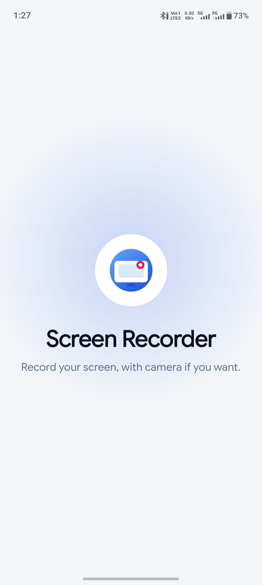
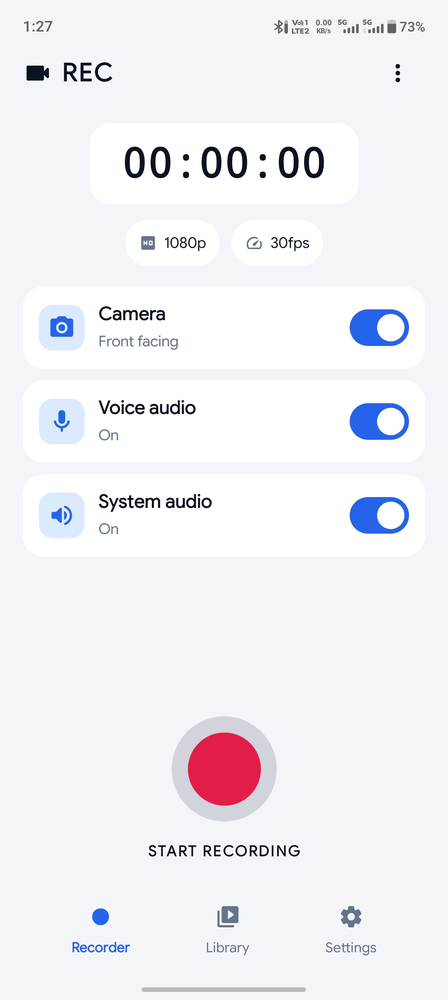
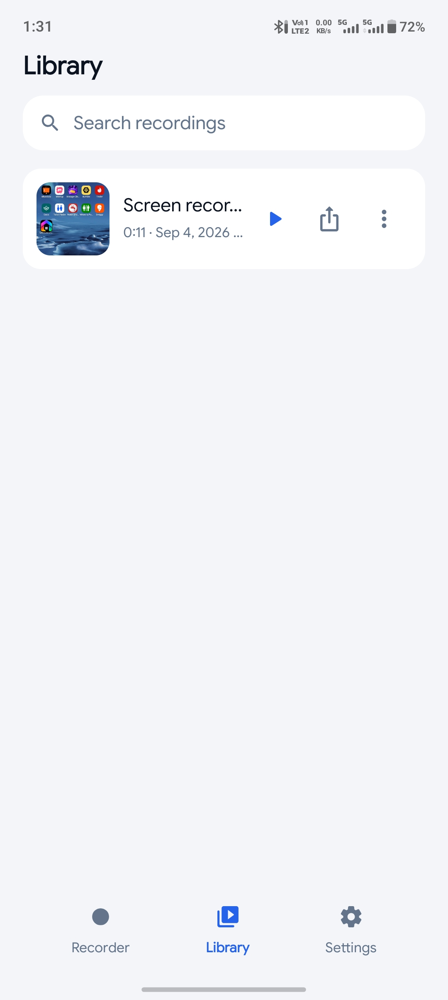
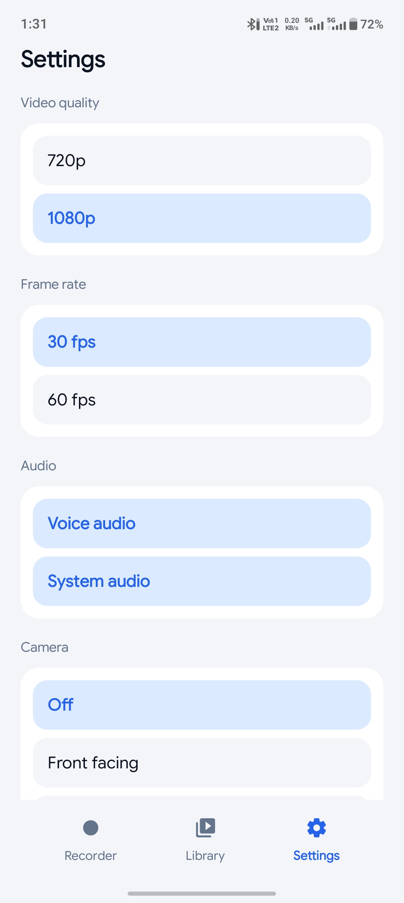

# Screen Recorder

A simple and clean Android screen recording app built to make screen recording quick and flexible.

The app lets users record their screen with optional camera, voice audio, and system audio, while providing basic recording settings and a built-in library to manage recordings.

## Features

- Screen recording with start/stop controls
- 720p and 1080p video quality
- 30 FPS and 60 FPS options
- Voice audio recording
- System audio recording
- Front-facing camera support
- Recording library with saved recordings
- Search recordings
- Play and share recorded videos
- Simple and clean settings screen
- Modern Android UI

## Screenshots

  
  

  
  

## Tech Stack

- Kotlin
- Jetpack Compose
- Material 3
- Android MediaProjection API
- Android MediaRecorder / Media APIs

## My Role

Designed and developed the application independently, including the UI, recording flow, settings, audio/camera controls, and recording library.

## Highlights

This project focuses on working with Android's screen capture and media capabilities while keeping the user experience simple and easy to understand.

It demonstrates practical Android development, state management, media handling, permissions, and modern UI development with Jetpack Compose.
